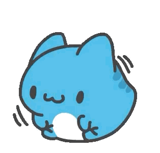
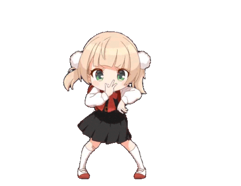

</br>

<!-- Header Banner -->
<p align="center">
  
</p>

<!-- Animated Typing -->
<p align="center">
  <a href="https://git.io/typing-svg">
    
  </a>
</p>

<!-- Profile Views Counter -->
<p align="center">
  
</p>

<!-- Social Badges -->
<p align="center">
  <a href="https://www.linkedin.com/in/danieljalali" target="_blank"></a>
  <a href="mailto:lin8x.github@gmail.com"></a>
  <a href="https://danieljalali.com/" target="_blank"></a>
</p>

<p align="center">
  <a href="https://github.com/lin8x?tab=followers"></a>
  <a href="https://github.com/lin8x?tab=repositories&sort=stargazers"></a>
</p>

<p align="center">
  
</p>

<br>

<!-- Wave Divider -->


<br>

##  About Me

```python
class DanielJalali:
    def __init__(self):
        self.name = "Daniel Jalali"
        self.title = "Software & Game Developer"
        self.education = {
            "degree": ["B.A. Computer Science", "Certificate for Big Data, Ai, & Ethics"],
            "location": "United States of America"
        }
        self.languages = ["Python", "C#", "Java", "JavaScript", "Kotlin", "SQL"]
        self.interests = ["Automation", "Infrastructure", "Game Dev", "AR/VR", "AI"]
        
    def current_focus(self):
        return [
            "☁️ Infrastructure & cloud certifications",
            "🐍 Python automation & data pipelines",
            "🗃️ SQL & database architecture",
            "🎮 Game development with Unity & Unreal",
            "🤖 AI fundamentals for production"
        ]
    
    def say_hi(self):
        print("Thanks for stopping by! Let's build something amazing together!")

me = DanielJalali()
me.say_hi()
```

</td>
</tr>
</table>

<br>


<br>

##  Tech Stack

<table align="center">
<tr>
<td align="center" width="150"><b>💻 Languages</b></td>
<td align="center">

</td>
</tr>
<tr>
<td align="center"><b>🎮 Game Dev</b><br></td>
<td align="center">

</td>
</tr>
<tr>
<td align="center"><b>🗄️ Databases</b></td>
<td align="center">

</td>
</tr>
<tr>
<td align="center"><b>☁️ Cloud & DevOps</b><br></td>
<td align="center">

</td>
</tr>
<tr>
<td align="center"><b>🔧 Tools</b></td>
<td align="center">

</td>
</tr>
</table>

<br>


<br>

##  Certifications & Awards </br>

<p align="center">
  
  
  
  
</p>

<p align="center">
  
</p>

<p align="center">
  
  
</p>

<br>


<br>

###  Active Repositories 

<p align="center">
  <a href="https://github.com/Lin8x/LAPS"></a>
  <a href="https://github.com/Lin8x/Instergater"></a>
</p>

<br>


<br>

##  Experience Highlights

<table align="center">
<tr>
<td align="center" width="200">
<br>
<b>Sr. Lab Assistant</b><br>
<sub>Unity AR/VR Developer</sub><br>
<sub>2022 - 2024</sub>
</td>
<td align="center" width="200">
<br>
<b>Data Science Intern</b><br>
<sub>Python, Power BI, Azure</sub><br>
<sub>2024</sub>
</td>
<td align="center" width="200">
<br>
<b>Software Engineering Intern</b><br>
<sub>Python, MySQL, Automation</sub><br>
<sub>2024</sub>
</td>
</tr>
<tr>
<td align="center">
<br>
<b>Product Manager</b><br>
<sub>Led 20-person teams</sub><br>
<sub>2022 - 2024</sub>
</td>
<td align="center">
<br>
<b>Game Dev Tech Lead</b><br>
<sub>Unity Workshops</sub><br>
<sub>2021 - 2024</sub>
</td>
<td align="center">
<br>
<b>Lead Developer</b><br>
<sub>Built 12 Unity packages</sub><br>
<sub>2023</sub>
</td>
</tr>
</table>

<br>


<br>

##  GitHub Analytics

<p align="center">
  <a href="https://github.com/lin8x">
    
    
  </a>
</p>

<!-- GitHub Trophies -->
<p align="center">
  <a href="https://github.com/lin8x">
    
  </a>
</p>

<!-- Activity Graph -->
<p align="center">
  <a href="https://github.com/lin8x">
    
  </a>
</p>

<br>


<br>

##  Contribution Snake

<p align="center">
  <picture>
    <source media="(prefers-color-scheme: dark)" srcset="https://raw.githubusercontent.com/platane/snk/output/github-contribution-grid-snake-dark.svg">
    <source media="(prefers-color-scheme: light)" srcset="https://raw.githubusercontent.com/platane/snk/output/github-contribution-grid-snake.svg">
    
  </picture>
</p>

<!-- Dance Party -->
<p align="center">
  
</p>

<br>


<br>

<br>

<!-- Footer -->
<p align="center">
  
</p>

<p align="center">
  <b>✨ Let's create something extraordinary together! ✨</b>
</p>

<p align="center">
  <i>"The only way to do great work is to love what you do."</i>
</p>

<p align="center">
  
</p>
