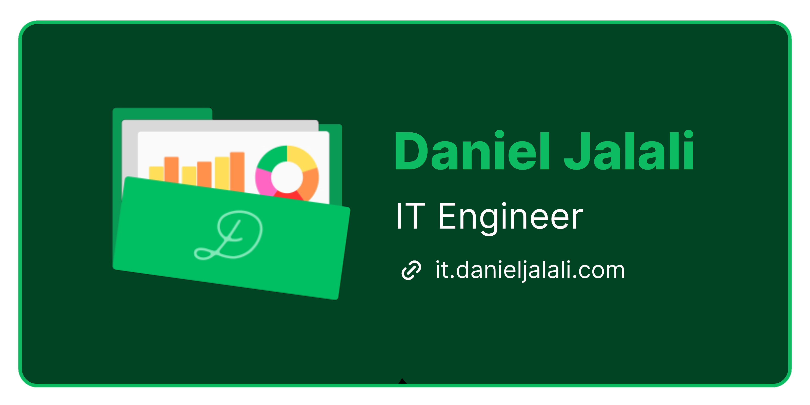
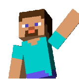
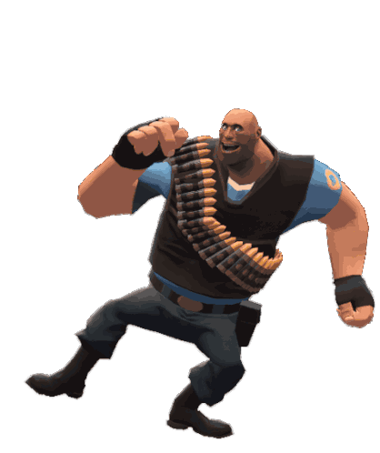
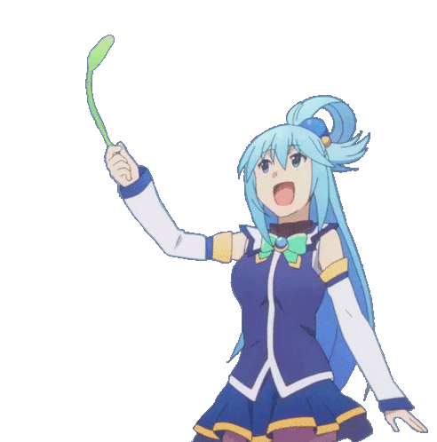

 

<!-- Header Banner -->

  

<!-- Animated Typing -->

  

<!-- Social Badges -->

  
  
  

  
  

  

 

<!-- Wave Divider -->

 

##  About Me

**CS graduate** with internship experience in **data science**, **software engineering**, and **AR/VR development**.

I've worked across government, startup, and research environments; building prediction models, 
automation tools, and cross-platform applications. I've presented technical work to senior leadership, 
collaborated on teams of 5-20 people, and shipped projects under tight deadlines.

**What I do best:**
- 🐍 **Python** — Data pipelines, automation scripts, backend services
- 🗃️ **SQL & Databases** — MySQL, data modeling, query optimization
- ☁️ **Cloud & DevOps** — AWS, Azure, Git, CI/CD workflows

I prioritize solutions that are **reliable, maintainable, and easy to reason about** over clever or complex ones.

 

 

##  Tech Stack

<table align="center">
<tr>
<td align="center" width="150"><b>💻 Languages</b></td>
<td align="center">

</td>
</tr>
<tr>
<td align="center"><b>🎮 Game Dev</b> </td>
<td align="center">

</td>
</tr>
<tr>
<td align="center"><b>🗄️ Databases</b></td>
<td align="center">

</td>
</tr>
<tr>
<td align="center"><b>☁️ Cloud & DevOps</b> </td>
<td align="center">

</td>
</tr>
<tr>
<td align="center"><b>🔧 Tools</b></td>
<td align="center">

</td>
</tr>
</table>

 

 

##  Certifications  

  
  

  🔐 Credential IDs: Azure DP-900: <code>8EC56E591D97D935</code> | Unity: <code>wvExk-H9mk</code>

 

 

##  Experience Highlights

<table align="center">
<tr>
<td align="center" width="300">
 
<b>Data Science Intern</b> 
Python, Power BI, Azure DevOps 
2024
</td>
<td align="center" width="300">
 
<b>Software Engineering Intern</b> 
Python, MySQL, Automation 
2024
</td>
<td align="center" width="300">
 
<b>Sr. Lab Assistant</b> 
AR/VR, iOS, Android, HoloLens 
2022 - 2024
</td>
</tr>
</table>

 

<b>🏛️ Government Agency — Data Science Intern</b>

 

- Built prediction models and data visualizations using **Python**, **Seaborn**, and **Matplotlib**
- Created interactive **Power BI** dashboards for stakeholder communication
- Managed version control and CI/CD with **Azure DevOps** and **Git**
- Presented final project outcomes to senior leadership including the agency's CIO
- Collaborated with a team of 5 interns on a successful data-driven project

<b>💻 Tech Startup — Software Engineering Intern</b>

 

- Built internal automation tools in **Python**, **JavaScript**, and **C#** for a 10-person dev team
- Managed **MySQL** database for efficient data storage and retrieval
- Developed tooling that supported communities of **700+ users**

<b>🔬 Research Lab — Sr. Lab Assistant</b>

 

- One of two developers trusted with building advanced **AR/VR applications** for architectural analysis
- Deployed cross-platform apps for **iOS**, **Android**, and **HoloLens**
- Researched and implemented AR features using **Niantic Lightship ARDK** (e.g., VPS-related workflows where applicable)
- Collaborated across departments: management, architecture, modeling, and design

<b>🎮 Non-Profit Org — Product Manager</b>

 

- Led a **20-person team** to ship a product within a 2-month deadline
- Coordinated 3 departments using **Trello** for task management and sprint planning
- Managed dev toolchain: **Unity**, **GitHub**, **Blender**, **Visual Studio**

 

 

<!-- Footer -->

  

  

